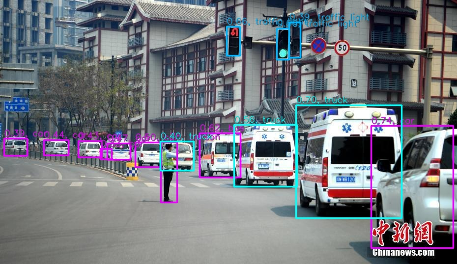
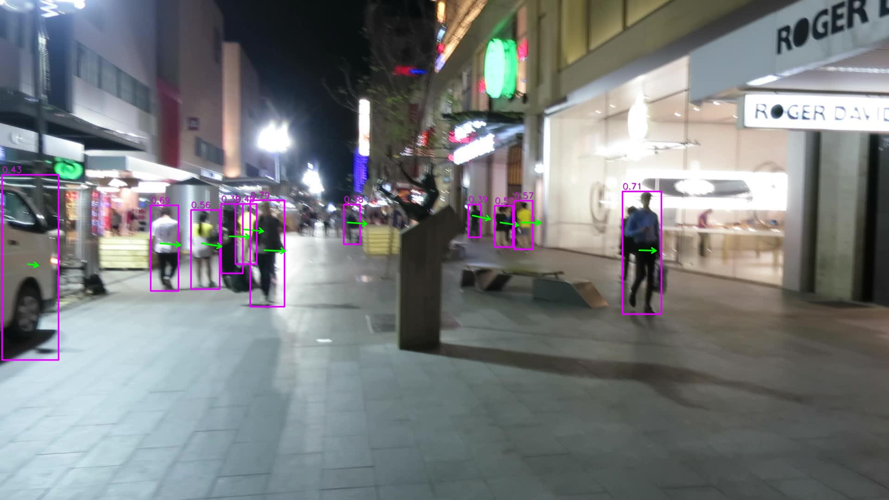

# TensorRT-Integrate

1. Support pytorch onnx plugin（DCN、HSwish ... etc.）
2. Simpler inference and plugin APIs

<br/>


## Re-implement
##### [CenterNet : ctdet_coco_dla_2x](https://github.com/xingyizhou/CenterNet)



<br/>

##### [CenterTrack: coco_tracking](https://github.com/xingyizhou/CenterTrack)



* [coco_tracking.onnx download](http://zifuture.com:1000/fs/public_models/coco_tracking.onnx)

* [nuScenes_3Dtracking.onnx download](http://zifuture.com:1000/fs/public_models/nuScenes_3Dtracking.onnx)

<br/>

##### [DBFace](https://github.com/dlunion/DBFace)


## Use TensorRT-Integrate

install protobuf >= v3.8.x

```bash
bash getDLADCN.sh
make run -j32
```

<br/>

## Inference Code

```
auto engine = TRTInfer::loadEngine("models/efficientnet-b0.fp32.trtmodel");
float mean[3] = {0.485, 0.456, 0.406};
float std[3] = {0.229, 0.224, 0.225};
Mat image = imread("img.jpg");
engine->input()->setNormMat(0, image, mean, std);
engine->forward();
engine->output(0)->print();
```

<br/>

## Environment

* tensorRT7.0.0.11
* opencv3.4.6
* cudnn7.6.3
* cuda10.0
* protobuf v3.8.x
* Visual Studio 2017
* [lean-windows.zip (include tensorRT、opencv、cudnn、cuda、protobuf)](http://zifuture.com:1000/fs/25.shared/lean.zip)

<br/>

## Plugin

1. Pytorch export ONNX:  [plugin_onnx_export.py](plugin_onnx_export.py)
2. [MReLU.cu](src/onnxplugin/plugins/MReLU.cu) 、[HSwish.cu](src/onnxplugin/plugins/HSwish.cu)、[DCNv2.cu](src/onnxplugin/plugins/DCNv2.cu)

<br/>